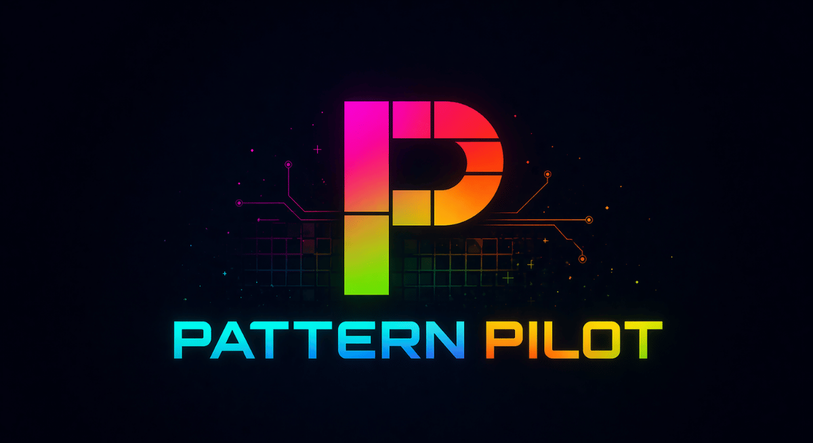
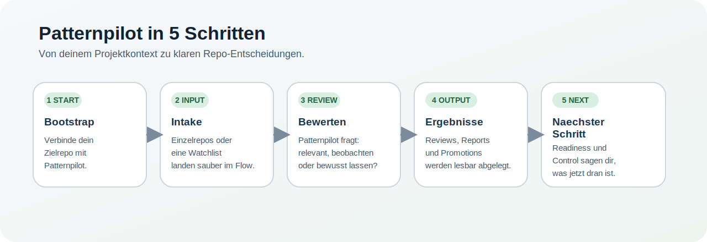
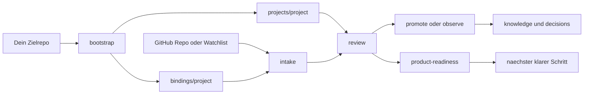
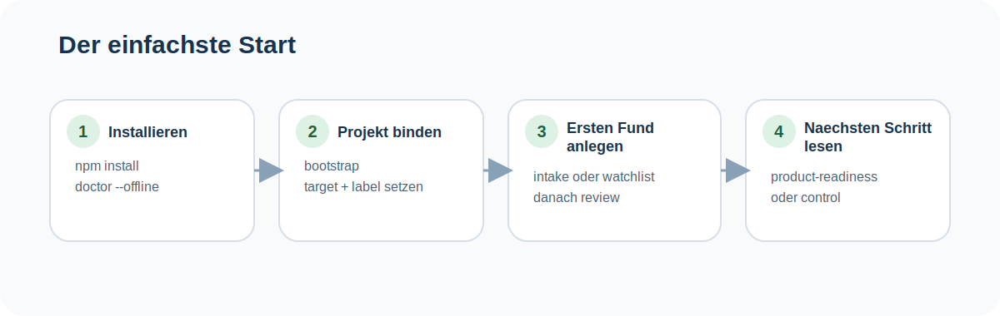
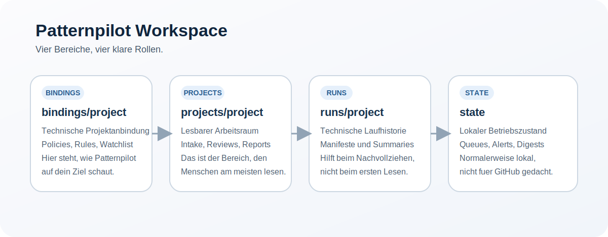

<p align="center">
  
</p>

# Patternpilot

`patternpilot` ist ein lokales Produkt fuer Repo-Intelligence.

Es hilft dir, externe GitHub-Repositories nicht nur zu sammeln, sondern im Kontext deines eigenen Produkts zu bewerten:

- Was ist wirklich relevant?
- Was ist nur interessant?
- Was solltest du uebernehmen, beobachten oder bewusst nicht uebernehmen?


## Quick View

<p align="center">
  
</p>

### Was Patternpilot macht

- bindet dein eigenes Zielrepo als Bezugspunkt an
- sammelt externe GitHub-Repos nicht blind, sondern bewertet sie relativ zu deinem Projekt
- fuehrt von Intake ueber Review bis zu kuratierten Learnings und Entscheidungen
- trennt bewusst zwischen Produktcode, lokalem Laufzeit-Zustand und projektbezogenen Ergebnissen

### Was du dafuer brauchst

- lokal: `npm install`
- fuer den ersten Test: kein GitHub-Login zwingend noetig
- fuer stabile echte GitHub-Laeufe: ein GitHub-Konto und ein fine-grained Token in `.env.local`
- spaeter optional: eine GitHub App fuer tiefere Automation

### Was du danach bekommst

- `bindings/<project>/` fuer die technische Projektanbindung
- `projects/<project>/` fuer lesbare Intake-, Review- und Report-Artefakte
- `runs/<project>/` fuer nachvollziehbare Laufhistorie
- `state/` fuer lokalen Betriebszustand


## So Arbeitet Patternpilot



### Was Patternpilot ausmacht

- Es bewertet Repos immer relativ zu einem Zielprojekt, nicht abstrakt.
- Es fuehrt den Nutzer vom ersten Setup bis zum naechsten sinnvollen Schritt.
- Es trennt kuratierte Produktwahrheit bewusst von lokalen Runtime-Artefakten.
- Es ist lokal nutzbar, aber vorbereitet fuer spaetere GitHub-Automation.
- Automation ist bewusst eine optionale Betriebsoberflaeche, nicht der Pflichtkern.


## Einstieg Und Onboarding

### Schnellstart

Wenn du einfach nur loslegen willst, nimm genau diese vier Schritte:

```bash
npm install
npm run doctor -- --offline
npm run bootstrap -- --project my-project --target ../my-project --label "My Project"
npm run intake -- --project my-project https://github.com/example/repo
```

Danach hast du einen ersten echten Durchlauf.

### Wenn du direkt sauber mit GitHub arbeiten willst

```bash
npm run init:env
npm run setup:checklist
npm run doctor
```

Danach kannst du stabiler mit echten GitHub-Repos arbeiten.

### Einfacher Start Auf Einen Blick

Diese Grafik ist die kuerzeste visuelle Einstiegshilfe.
Sie ist bewusst fuer normale Nutzer geschrieben: kurzer Schritt, passender Command, kurze Bedeutung.

<p align="center">
  
</p>

### Weitere Onboarding-Doku

- Sehr einfach und in klarer Sprache:
  [SIMPLE_GUIDE.md](docs/foundation/SIMPLE_GUIDE.md)
- Einfach und kurz:
  [GETTING_STARTED.md](docs/foundation/GETTING_STARTED.md)
- Technischer und ausfuehrlicher:
  [ADVANCED_GUIDE.md](docs/foundation/ADVANCED_GUIDE.md)
- Wenn du lieber direkt in der CLI gefuehrt werden willst:
  `npm run getting-started`


## Arbeitsmodell Und Repo-Struktur

### Produktlogik in einem Satz

`patternpilot` bewertet fremde Repos nie abstrakt, sondern immer relativ zu einem Zielprojekt.

Darum ist der erste echte Schritt fast nie `discover`, sondern fast immer `bootstrap` oder `init:project`.

### Was danach im Repo passiert

`patternpilot` trennt bewusst vier Bereiche:

- `bindings/<project>/`
  Die technische Anbindung an dein Zielprojekt.
- `projects/<project>/`
  Der lesbare Arbeits- und Ergebnisraum fuer dieses Zielprojekt.
- `runs/<project>/`
  Laufprotokolle und technische Nachvollziehbarkeit.
- `state/`
  Lokaler Betriebszustand wie Queue, Alerts und Runtime-Snapshots.

Wichtig:

- Dieses Repo startet jetzt produktseitig leer.
- Es wird kein reales Kunden- oder Dogfood-Projekt mehr als aktives Beispiel mitgeliefert.
- Wenn du ein Beispiel sehen willst, nutze das bewusst fiktive Paket unter [examples/demo-city-guide/README.md](examples/demo-city-guide/README.md).

### Workspace Auf Einen Blick

<p align="center">
  
</p>


## Die Wichtigsten Befehle

- `npm run bootstrap -- --project my-project --target ../my-project --label "My Project"`
  Erstellt die lokale Konfiguration und bindet dein erstes Zielrepo.
- `npm run intake -- --project my-project <github-url>`
  Legt einen einzelnen Fund sauber an.
- `npm run sync:watchlist -- --project my-project`
  Arbeitet die Watchlist fuer ein Projekt ab.
- `npm run review:watchlist -- --project my-project --dry-run`
  Verdichtet Watchlist-Funde zu einem Review.
- `npm run patternpilot -- discover --project my-project --dry-run`
  Sucht optional automatisch nach moeglich passenden GitHub-Repos fuer dein Zielprojekt.
- `npm run patternpilot -- discover-evaluate --project my-project`
  Bewertet gespeicherte Discovery-Runs und zeigt gute oder noisige Query-Familien.
- `npm run validate:cohort`
  Faellt die breite Fremdprojekt-Welle ueber die eingebaute Referenzkohorte.
- `npm run patternpilot -- product-readiness`
  Zeigt, wie nah dein lokaler Setup an einem belastbaren Betriebszustand ist.


## Fuer Fortgeschrittene Nutzer

- Produkt- und Systembild:
  [OPERATING_MODEL.md](docs/foundation/OPERATING_MODEL.md)
- Ehrlicher Produktstatus:
  [V1_STATUS.md](docs/foundation/V1_STATUS.md)
- Projekt-Alignment:
  [PROJECT_ALIGNMENT_MODEL.md](docs/reference/PROJECT_ALIGNMENT_MODEL.md)
- GitHub-Discovery:
  [GITHUB_DISCOVERY_MODEL.md](docs/reference/GITHUB_DISCOVERY_MODEL.md)
- GitHub-Token-Setup:
  [GITHUB_TOKEN_SETUP.md](docs/reference/GITHUB_TOKEN_SETUP.md)
- Automation und Alerts:
  [AUTOMATION_ALERT_DELIVERY.md](docs/reference/AUTOMATION_ALERT_DELIVERY.md)
- Automation-Betriebsgrenze:
  [AUTOMATION_OPERATING_MODE.md](docs/foundation/AUTOMATION_OPERATING_MODE.md)


## Open Source Und Mitmachen

### Was Open Source hier bedeutet

`patternpilot` ist ein oeffentliches Open-Source-Projekt.

Das heisst:

- du kannst es klonen
- du kannst es selbst nutzen
- du kannst es anpassen
- du kannst es weiterentwickeln

Die Lizenz dafuer ist:

- [Apache-2.0](LICENSE)

### Was "Mitmachen" hier bedeutet

"Mitmachen" meint hier `Contributing`.

Das bedeutet konkret:

- Bugs melden
- Doku verbessern
- kleine oder groessere Code-Verbesserungen beisteuern
- Nutzerfuehrung klarer machen
- Reports, Discovery oder Workflows verbessern

Die Regeln und der lokale Entwicklungsfluss stehen hier:

- [CONTRIBUTING.md](CONTRIBUTING.md)

### Wichtige Open-Source-Dokumente

- Changelog:
  [CHANGELOG.md](CHANGELOG.md)
- Release Notes:
  [RELEASE_NOTES_v0.1.0.md](docs/foundation/RELEASE_NOTES_v0.1.0.md)
- Freigabeform:
  [OPEN_SOURCE_RELEASE.md](docs/foundation/OPEN_SOURCE_RELEASE.md)
- Release-Check:
  [RELEASE_CHECKLIST.md](docs/foundation/RELEASE_CHECKLIST.md)
- Release-Kommunikation:
  [RELEASE_COMMUNICATION.md](docs/foundation/RELEASE_COMMUNICATION.md)


## Oeffentlich Vs. Lokal

`patternpilot` versioniert Produktcode und bewusst gepflegte Referenzdokumente.

Faustregel:

- Was in Git committed und nach GitHub gepusht wird, ist oeffentlich.
- Was von `.gitignore` erfasst ist oder nur lokal untracked bleibt, bleibt lokal.

Es versioniert nicht automatisch:

- lokale Runtime-Zustaende aus `state/`
- datierte Run-Artefakte
- frische Intake-, Review- oder Promotion-Ausgaben aus Einzelruns

Details dazu stehen in:

- [PUBLIC_VS_LOCAL.md](docs/foundation/PUBLIC_VS_LOCAL.md)
