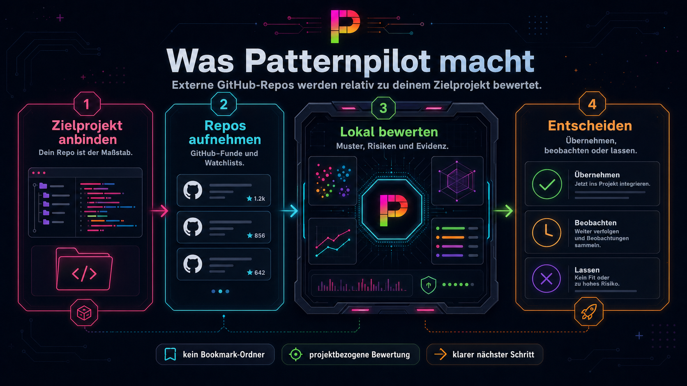
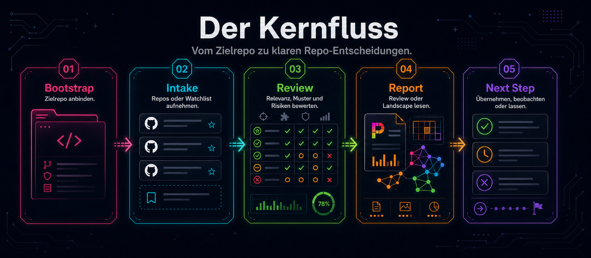
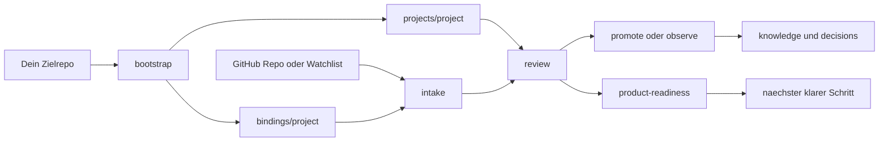
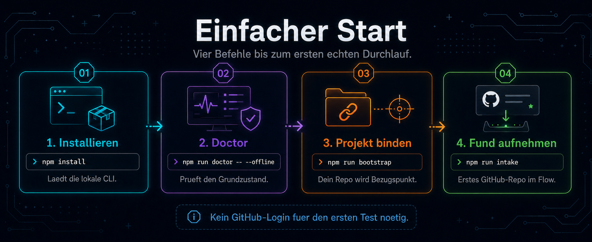
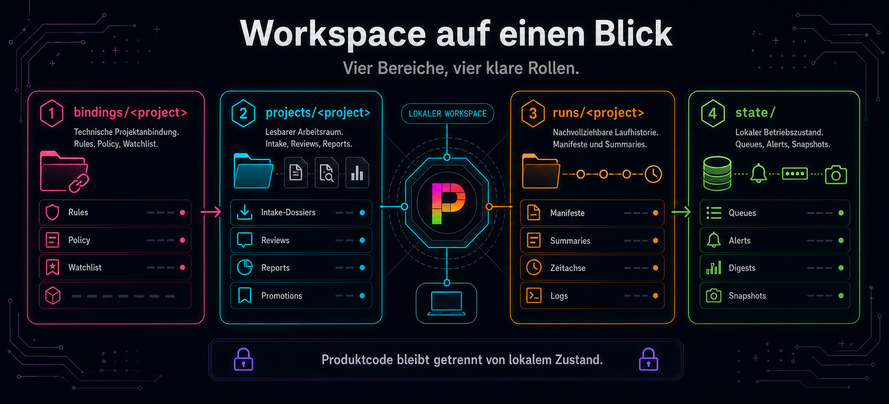
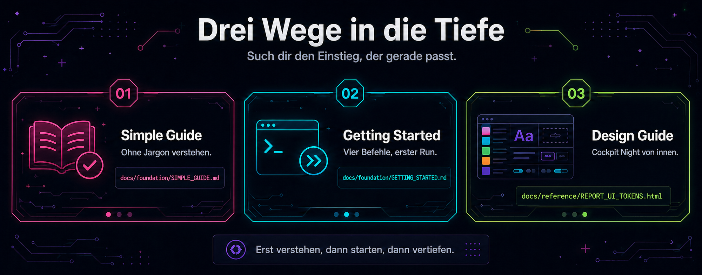
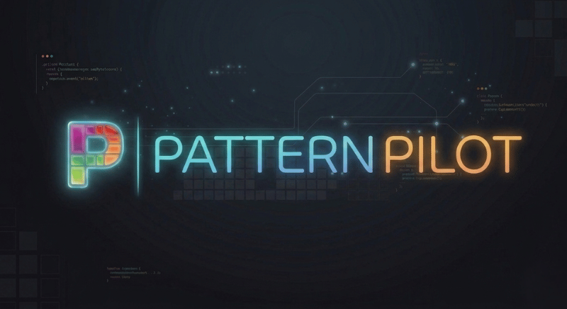

<p align="center">
  
</p>

# Patternpilot

`patternpilot` ist ein lokales Produkt fuer Repo-Intelligence.

Es hilft dir, externe GitHub-Repositories nicht nur zu sammeln, sondern im Kontext deines eigenen Produkts zu bewerten:

- Was ist wirklich relevant?
- Was ist nur interessant?
- Was solltest du uebernehmen, beobachten oder bewusst nicht uebernehmen?

<p align="center">
  
</p>


## Quick View

<p align="center">
  
</p>

### Was Patternpilot macht

- bindet dein eigenes Zielrepo als Bezugspunkt an
- sammelt externe GitHub-Repos nicht blind, sondern bewertet sie relativ zu deinem Projekt
- fuehrt von Intake ueber Review bis zu kuratierten Learnings und Entscheidungen
- faehrt im Problem-Mode gezielte Problem-Landscapes: Cluster-Analyse + KI-Coding-Agent-Handoff + Achsen-View
- erzeugt zwei final gestaltete HTML-Reports (Discovery/Review + Landscape) im eigenen Cockpit-Night-Design-System
- trennt bewusst zwischen Produktcode, lokalem Laufzeit-Zustand und projektbezogenen Ergebnissen
- misst die Qualitaet jedes Runs ueber 9 Achsen (Struktur + Inhalt) und kennt seine eigenen Grenzen — empirisch validiert auf 11 Runs in 9 Domaenen ueber 4 Projekte
- bietet projektspezifische Pattern-Family-Lexika und einen Suggester-Helper fuer fremde Domaenen

### Was du dafuer brauchst

- Node.js 20 oder neuer — laeuft nativ auf macOS, Linux und Windows (inkl. WSL)
- lokal: `npm install`
- fuer den ersten Test: kein GitHub-Login zwingend noetig
- fuer stabile echte GitHub-Laeufe: ein GitHub-Konto und ein fine-grained Token in `.env.local`
- spaeter optional: eine GitHub App fuer tiefere Automation

### Was du danach bekommst

- `bindings/<project>/` fuer die technische Projektanbindung
- `projects/<project>/` fuer lesbare Intake-, Review- und Report-Artefakte
- `runs/<project>/` fuer nachvollziehbare Laufhistorie
- `state/` fuer lokalen Betriebszustand


## So Arbeitet Patternpilot



### Was Patternpilot ausmacht

- Es bewertet Repos immer relativ zu einem Zielprojekt, nicht abstrakt.
- Es fuehrt den Nutzer vom ersten Setup bis zum naechsten sinnvollen Schritt.
- Es trennt kuratierte Produktwahrheit bewusst von lokalen Runtime-Artefakten.
- Es ist lokal nutzbar, aber vorbereitet fuer spaetere GitHub-Automation.
- Automation ist bewusst eine optionale Betriebsoberflaeche, nicht der Pflichtkern.


## Einstieg Und Onboarding

### Schnellstart

```bash
npm install -g patternpilot
patternpilot init
```

Der interaktive Wizard fragt in fuenf Schritten alles ab, was Patternpilot zum Loslegen braucht: Zielprojekt, Kontext, GitHub-Zugang, Discovery-Profil, optionale erste Aktion. Dauer ≤ 90 Sekunden bei Default-Antworten.

### Was der Wizard tut

1. **Zielprojekt finden** — automatischer Scan der ueblichen Pfade (`../`, `~/dev/`, `~/projects/`), Top 3 zur Auswahl
2. **Kontext bestaetigen** — Label, Sprache, Context-Files und Watchlist-Seed aus `package.json#dependencies` werden vorgeschlagen
3. **GitHub-Zugang** — gh CLI oder Personal Access Token oder Skip; bei PAT mit Schritt-fuer-Schritt-Anleitung inkl. vorausgewaehlter Scopes
4. **Discovery-Profil** — `balanced` (empfohlen) oder `focused`
5. **Erste Aktion** — sofort `intake`, `discover`, `problem` (Landscape) oder einfach Setup speichern

### Nicht-interaktive Nutzung

Fuer CI, Doku-Generierung oder gepipte Aufrufe:

```bash
patternpilot init --print
```

Zeigt die Schritt-Liste als reinen Text, ohne Fragen zu stellen. Identisch zum frueheren `getting-started`-Output.

### Re-Konfiguration

Nach dem ersten Setup oeffnet `patternpilot init` ein Aktionsmenue (neues Projekt hinzufuegen, Token erneuern, Default wechseln, …). Fuer ein vollstaendiges neues Setup `--reconfigure` setzen.

### Einfacher Start Auf Einen Blick

Diese Grafik ist die kuerzeste visuelle Einstiegshilfe.
Sie ist bewusst fuer normale Nutzer geschrieben: kurzer Schritt, passender Command, kurze Bedeutung.

<p align="center">
  
</p>

### Weitere Onboarding-Doku

- Sehr einfach und in klarer Sprache:
  [SIMPLE_GUIDE.md](docs/foundation/SIMPLE_GUIDE.md)
- Einfach und kurz:
  [GETTING_STARTED.md](docs/foundation/GETTING_STARTED.md)
- Technischer und ausfuehrlicher:
  [ADVANCED_GUIDE.md](docs/foundation/ADVANCED_GUIDE.md)
- Wenn du lieber direkt in der CLI gefuehrt werden willst:
  `patternpilot init`  (interaktiv)  oder  `patternpilot init --print`  (nur Text)


## Arbeitsmodell Und Repo-Struktur

### Produktlogik in einem Satz

`patternpilot` bewertet fremde Repos nie abstrakt, sondern immer relativ zu einem Zielprojekt.

Darum ist der erste echte Schritt fast nie `discover`, sondern fast immer `bootstrap` oder `init:project`.

### Was danach im Repo passiert

`patternpilot` trennt bewusst vier Bereiche:

- `bindings/<project>/`
  Die technische Anbindung an dein Zielprojekt.
- `projects/<project>/`
  Der lesbare Arbeits- und Ergebnisraum fuer dieses Zielprojekt.
- `runs/<project>/`
  Laufprotokolle und technische Nachvollziehbarkeit.
- `state/`
  Lokaler Betriebszustand wie Queue, Alerts und Runtime-Snapshots.

Wichtig:

- Dieses Repo startet jetzt produktseitig leer.
- Es wird kein reales Kunden- oder Dogfood-Projekt mehr als aktives Beispiel mitgeliefert.
- Wenn du ein Beispiel sehen willst, nutze das bewusst fiktive Paket unter [examples/demo-city-guide/README.md](examples/demo-city-guide/README.md).

### Workspace Auf Einen Blick

<p align="center">
  
</p>


## Die Wichtigsten Befehle

### Setup & Anbindung

- `npm run bootstrap -- --project my-project --target ../my-project --label "My Project"`
  Erstellt die lokale Konfiguration und bindet dein erstes Zielrepo.
- `npm run doctor`
  Prueft Token, Pfade, Lokale-Konfiguration. Mit `--offline` ohne GitHub.
- `npm run patternpilot -- product-readiness`
  Zeigt, wie nah dein Setup an einem belastbaren Betriebszustand ist.

### Haupt-Fluss: Repos rein, Review raus

- `npm run intake -- --project my-project <github-url>`
  Legt einen einzelnen Fund sauber an.
- `npm run sync:watchlist -- --project my-project`
  Arbeitet die Watchlist fuer ein Projekt ab.
- `npm run review:watchlist -- --project my-project --dry-run`
  Verdichtet Watchlist-Funde zu einem Review.
- `npm run patternpilot -- discover --project my-project --dry-run`
  Sucht optional automatisch nach moeglich passenden GitHub-Repos.
- `npm run patternpilot -- discover-evaluate --project my-project`
  Bewertet gespeicherte Discovery-Runs und zeigt gute oder noisige Query-Familien.

### Problem-Mode: von der Frage zur Landscape

- `npm run problem:create -- --project my-project --title "..."`
  Legt ein problem.md-Artefakt an. Ohne `--project` als standalone-Problem.
- `npm run problem:explore -- <slug>`
  Startet den Kettenlauf: targeted discovery → clustering → Solution-Landscape + Brief.
- `npm run problem:list`
  Listet alle aktiven Probleme mit letzter Landscape-Referenz.

### Validation & Analyse-Profile

- `npm run validate:cohort`
  Faellt die breite Fremdprojekt-Welle ueber die eingebaute Referenzkohorte.
- `npm run patternpilot -- discover --project my-project --per-page 50 --depth deep`
  Tiefere Discovery mit mehr Kandidaten pro Query.

### Score & Stabilitaet — Pipeline-Qualitaet messen

- `npm run score -- <run-path> --pretty`
  Bewertet einen einzelnen Landscape- oder Review-Run ueber 9 Achsen (5 Struktur + 4 Inhalt) und gibt einen 0-10-Combined-Score aus.
- `npm run score:baseline`
  Re-scort die vier eingefrorenen Baseline-Fixtures unter `test/fixtures/score-baseline/`.
- `npm run stability-test -- --runs <a,b,c>`
  Aggregiert N Run-Scores zu Median, Min, Max, Mean — fuer Cross-Project-Vergleiche und Acceptance-Tests.
- `npm run lexicon:suggest -- --project <key> --output docs/foundation/lexicon-suggestions.md`
  Schlaegt anhand `unknown`-klassifizierter Repos neue Pattern-Familien fuers Lexikon vor.

Detailliert: [SCORE_STABILITY_PLAN.md](docs/foundation/SCORE_STABILITY_PLAN.md), [SCORE_STABILITY_RESULTS.md](docs/foundation/SCORE_STABILITY_RESULTS.md).

### Phase-Flags fuer Real-World-Runs

Drei opt-in Flags an `problem:explore` und `review:watchlist`, die die Pipeline-Qualitaet bei Bedarf hochziehen:

- `--seed-strategy auto` — Diversifier supplementiert kollabierte Query-Seeds aus einem Dictionary
- `--pattern-family auto` — Lexikon-basierter Repo-Klassifikator fuellt Cluster-Familien (95-100 % auf in-domain Runs)
- `--auto-discover` — bei leerer Watchlist triggert `review:watchlist` automatisch eine fokussierte Discovery + Intake
- `--slow` — Hard-Throttle 1 req/s gegen GitHub-Search-API-Rate-Limit (30/min)

Per-Project-Lexikon: lege `bindings/<project>/PATTERN_FAMILY_LEXICON.json` an, um den Klassifikator fuer eine fremde Domaene zu erweitern. Default-Lexikon und Project-Lexikon werden automatisch gemerged.


## Reports & Design System

`patternpilot` produziert zwei **voll gestaltete HTML-Reports** und einen eigenen **Design-Guide**. Alle drei sind inhaltlich und strukturell final — nur Inhalte atmen weiter, Layout steht.

### Landscape-Report (Problem-Mode)

- erzeugt von `npm run problem:explore -- <slug> --project <project>`
- cluster-orientiert: 21 Sections mit Problem-Details, Entscheidungen, Empfehlungen, Problem-Linsen, N Cluster, Coverage, Achsen-View, Risikosignale, KI Coding Agent, Lauf-Gesundheit und mehr
- Source: [`lib/landscape/html-report.mjs`](lib/landscape/html-report.mjs)

### Discovery / Review / On-Demand-Report

- erzeugt von `npm run review:watchlist`, `npm run on-demand`, `npm run sync:watchlist`
- kandidaten-orientiert: Empfehlungen, Top-Vergleichs-Repos, Repo-Matrix, Coverage, Zielrepo-Kontext, KI Coding Agent, Lauf-Gesundheit, Was-Jetzt-Actions
- Source: [`lib/html-renderer.mjs`](lib/html-renderer.mjs)

### Cockpit-Night-Styleguide

- 17-Kapitel-Design-Deliverable mit Prinzipien, Farbsystem (4 Familien, 23 Tokens), Typografie-Skala, allen Komponenten-States und Do/Don't-Karten
- Build: `node scripts/generate-styleguide.mjs`
- Rendered: [`docs/reference/REPORT_UI_TOKENS.html`](docs/reference/REPORT_UI_TOKENS.html)

Jeder Run haengt die drei HTML-Links in `projects/<project>/reports/browser-link` unter **"Design System & Docs"** — einmal Windows-UNC-Pfad zum Copy-Paste in den Browser.

Details, was sich aendern darf und was nicht: [`docs/reference/TEMPLATE_LOCK.md`](docs/reference/TEMPLATE_LOCK.md).


## Fuer Fortgeschrittene Nutzer

### Deep-Dive-Doku

- Produkt- und Systembild: [OPERATING_MODEL.md](docs/foundation/OPERATING_MODEL.md)
- Ehrlicher Produktstatus: [V1_STATUS.md](docs/foundation/V1_STATUS.md)
- Score-Stabilitaets-Plan (10 Phasen): [SCORE_STABILITY_PLAN.md](docs/foundation/SCORE_STABILITY_PLAN.md)
- Empirische Stabilitaets-Belege: [SCORE_STABILITY_RESULTS.md](docs/foundation/SCORE_STABILITY_RESULTS.md)
- Projekt-Alignment: [PROJECT_ALIGNMENT_MODEL.md](docs/reference/PROJECT_ALIGNMENT_MODEL.md)
- GitHub-Discovery-Modell: [GITHUB_DISCOVERY_MODEL.md](docs/reference/GITHUB_DISCOVERY_MODEL.md)
- GitHub-Token-Setup: [GITHUB_TOKEN_SETUP.md](docs/reference/GITHUB_TOKEN_SETUP.md)
- Automation und Alerts: [AUTOMATION_ALERT_DELIVERY.md](docs/reference/AUTOMATION_ALERT_DELIVERY.md)
- Automation-Betriebsgrenze: [AUTOMATION_OPERATING_MODE.md](docs/foundation/AUTOMATION_OPERATING_MODE.md)
- Report-Template-Lock: [TEMPLATE_LOCK.md](docs/reference/TEMPLATE_LOCK.md)

### GitHub-API-Limits im Blick behalten

GitHub gibt dir zwei getrennte Budgets, die sich unabhaengig voneinander nachfuellen:

- **REST — 5.000 Requests pro Stunde.** Fuer alles Normale: README holen, Lizenz pruefen, Topics lesen.
- **Search — 30 Requests pro Minute.** Eigenes Budget nur fuer GitHub-Suchen. Meistens der Engpass.

Ein Problem-Landscape-Lauf mit 12 Queries und `--per-page 20` verbraucht typisch 12 Search-Requests + ~50 REST-Requests — bleibt in beiden Budgets locker drin. Bei mehreren Laeufen hintereinander oder `--per-page 100` triffst du leicht die 30-Search-pro-Minute-Grenze. Wichtig: ein Lauf bricht bei einem `403` nicht ab, er liefert nur Teilergebnisse der gedrosselten Queries.

Zwei Hebel, um bewusst zu dosieren:

- **`--per-page <n>`** (1-100, Default 20) — wieviele Kandidaten pro Query zurueckkommen. Hoeher bringt mehr Vielfalt, kostet aber mehr REST-Requests.
- **`--depth <profile>`** (`focused` / `balanced` / `expansive` / `max`) — wieviele Query-Varianten ueberhaupt gefeuert werden.

**Faustregel:** Default 20 fuer Routine-Runs; `--per-page 50` fuer Einzel-Laeufe mit mehr Tiefe; `--per-page 100` nur fuer gezielte Tiefenanalysen. Bei Rate-Limit 2-Minuten-Pause — der Search-Kanister fuellt sich schnell wieder.


## Open Source

### Was Open Source hier bedeutet

`patternpilot` ist ein oeffentliches Open-Source-Projekt.

Das heisst:

- du kannst es klonen
- du kannst es selbst nutzen
- du kannst es anpassen
- du kannst es weiterentwickeln

Die Lizenz dafuer ist:

- [MIT](LICENSE)

### Wichtige Open-Source-Dokumente

- Beitragsregeln: [CONTRIBUTING.md](CONTRIBUTING.md)
- Changelog: [CHANGELOG.md](CHANGELOG.md)
- Release Notes: [RELEASE_NOTES_v0.2.0.md](docs/foundation/RELEASE_NOTES_v0.2.0.md)
- Freigabeform: [OPEN_SOURCE_RELEASE.md](docs/foundation/OPEN_SOURCE_RELEASE.md)
- Release-Check: [RELEASE_CHECKLIST.md](docs/foundation/RELEASE_CHECKLIST.md)
- Release-Kommunikation: [RELEASE_COMMUNICATION.md](docs/foundation/RELEASE_COMMUNICATION.md)


---

## Jetzt Starten

Pattern Pilot laeuft komplett lokal — kein Account, keine Cloud, keine Telemetrie.

Schnellster Einstieg ueber npm:

```bash
npm install -g patternpilot
patternpilot init
```

Vollstaendiger lokaler Workspace aus dem GitHub-Repo:

```bash
git clone https://github.com/Dom-303/patternpilot.git
cd patternpilot
npm install
npm run doctor -- --offline
```

Drei Wege in die Tiefe, je nachdem wie du tickst:

<p align="center">
  
</p>

<p align="center">
  <a href="docs/foundation/SIMPLE_GUIDE.md"><strong>Simple Guide</strong></a> ·
  <a href="docs/foundation/GETTING_STARTED.md"><strong>Getting Started</strong></a> ·
  <a href="docs/reference/REPORT_UI_TOKENS.html"><strong>Design-Guide</strong></a>
</p>


## Mitarbeiten

Pull Requests sind willkommen. Vor dem ersten PR kurz:

- [CONTRIBUTING.md](CONTRIBUTING.md) — Regeln und Ton
- [TEMPLATE_LOCK.md](docs/reference/TEMPLATE_LOCK.md) — was gefroren ist (Report-UI) und was atmet (Daten, Logik)
- Issues und Feedback: [github.com/Dom-303/patternpilot/issues](https://github.com/Dom-303/patternpilot/issues)


---

<p align="center">
  
</p>

<p align="center">
  <sub><strong>Pattern Pilot</strong> · Lokales Repo-Intelligence-Produkt · <a href="LICENSE">MIT-Lizenz</a> · gebaut mit Sorgfalt</sub>
</p>
